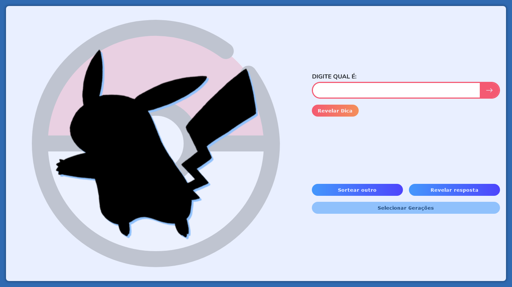

<h1 align="center">
    
</h1>

<h2 align='center'><a href='https://wendellwcl.github.io/poke-game/' target='_blank' style='display: block; color: #f45a72; font-weight: bold; margin: 30px'>Visitar projeto.</a></h2>

<h2 style='color: #f45a72'>Descrição do projeto:</h2>

    Umas das melhores e mais divertidas API para se utilizar é a PokeAPI, por isso foi a que escolhi para desenvolver um projeto.
    Optei em criar algo diferente da já famosa Pokedex, que muito se vê por ai. O resultado foi esse jogo de adivinhação, o "Quem é esse ?", inspirado na dinâmica que acontecia nos intervalos do próprio anime, onde se tem que descobrir quem é a espécie sorteada, apenas a partir do formato de sua sombra.
    <a href='https://wendellwcl.github.io/poke-game/' target='_blank' style='display: block; color: #f45a72; font-weight: bold; margin: 30px'>Clique aqui para acessar o projeto.</a>

    

<h2 style='color: #f45a72'>Tecnologias utilizadas:</h2>
<ul style='list-style: none; display: flex'>
    <li style='display: flex; flex-direction: column; align-items: center; margin-right: 30px'>
        
        HTML
    </li>
    <li style='display: flex; flex-direction: column; align-items: center; margin-right: 30px'>
        
        CSS
    </li>
    <li style='display: flex; flex-direction: column; align-items: center; margin-right: 30px'>
        
        Sass
    </li>    
    <li style='display: flex; flex-direction: column; align-items: center; margin-right: 30px'>
        
        JavaScript
    </li>
    <li style='display: flex; flex-direction: column; align-items: center; margin-right: 30px'>
        
        React
    </li>
</ul>
